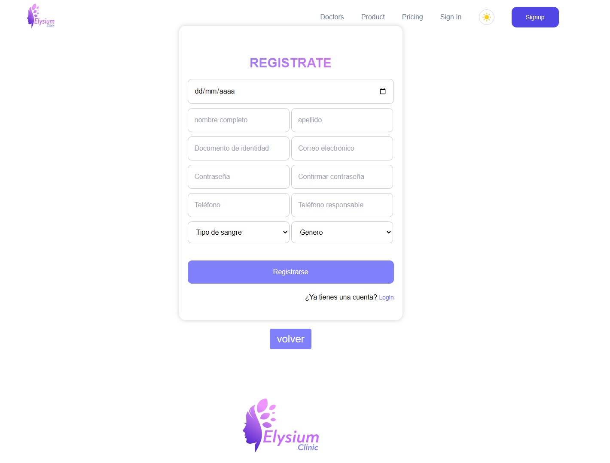
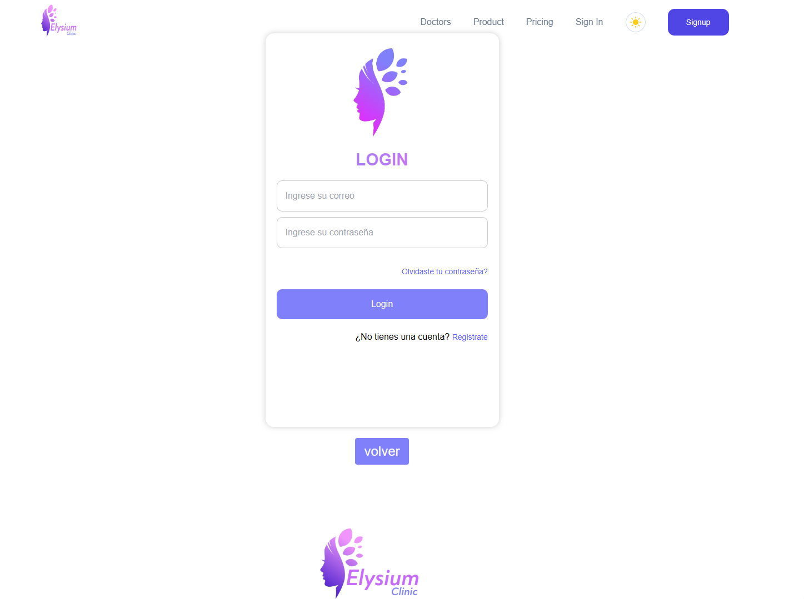
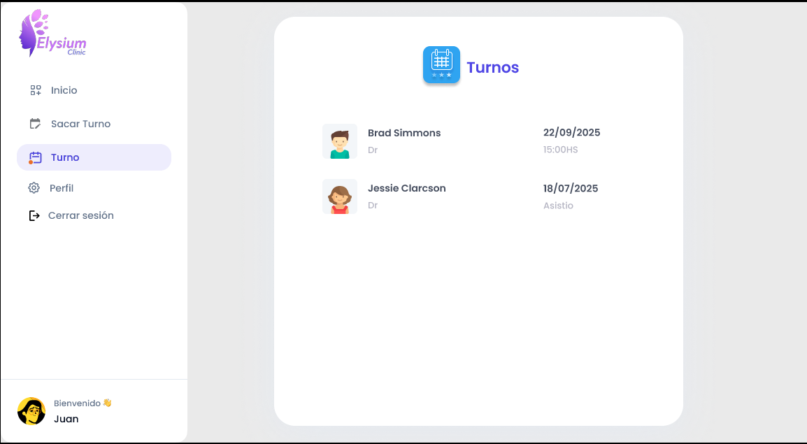
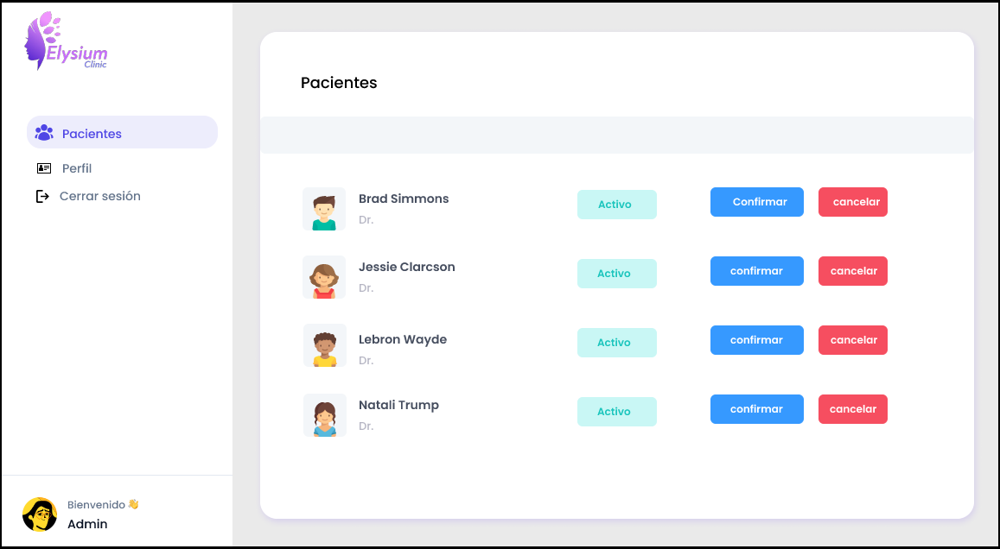
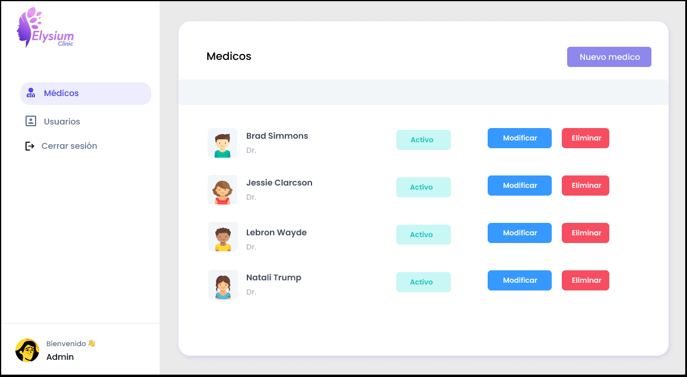

## 📘 Elysium Clinic

<div align="center">
  
</div>


**Descripción**  
Elysium Clinic es una aplicación web que permite a los pacientes registrarse y solicitar consultas medicas, a los médicos registrarse y gestionar las consultas, y a los administradores gestionar el sistema.

### 🛠️ Tecnologías Utilizadas

| 💻 Frontend | 💡 Backend |
| ----------- | ---------- |
| [](https://skillicons.dev)      | [](https://skillicons.dev)   |

---

### 🎯 Objetivos del Proyecto
1. Facilitar la gestión de una consutora medica mediante una interfaz intuitiva.
2. Proporcionar herramientas de gestion de citas.
3. Garantizar la seguridad de los datos mediante autenticación robusta.

---

### 🌟 Características Principales
- 📋 **Gestión de citas**: Crear, actualizar, y eliminar citas.  
- 🔍 **Gestión de usuarios**: Registro y gestión de usuarios y medicos.
- 👥 **Múltiples Usuarios**: Compatible con roles de administrador, usuario y medico.

---

### 🏛️ Decisiones de Arquitectura
#### Diagrama de Arquitectura


- **MVC**: Modelo de vista controlado (MVC) para la gestión de datos.
- **Autenticación JWT**: Seguridad basada en tokens para sesiones seguras.  
- **API REST Documentada**: Generada con Swagger para facilitar la integración.  

---

### ⚙️ Instalación y Configuración
1. **Requisitos Previos**:
   - Node.js (`v18.0+`) y npm (`v9.0+`)
   
2. **Clonar el Repositorio**:
   ```bash
   git clone https://github.com/usuario/proyecto.git
   cd proyecto
   ```

3. **Configurar Variables de Entorno**:
   Crea un archivo `.env` en el directorio raíz:
   ```env
   DB_URI=mongodb://localhost:27017/nombre_db
   JWT_SECRET=clave_secreta
   ```

4. **Iniciar el Proyecto**:
    1. En el directorio 'backend' ejecutar:
    ```sh
    npm install
    npm run dev
    ```
    2. En el directorio 'elysium-clinic_front' ejecutar:
    ```sh
    npm install
    npm run dev
    ```

---

### 🚀 Implementación y Mantenimiento
- **Despliegue**:   
- **Mantenimiento**: 
- **Monitoreo**:

---

### 📷 Capturas de Pantalla

#### 🔗[Figma](https://www.figma.com/design/fhiw8yyKNZ38zrYP6vjX1K/elysium)

| Pantalla | Descripción |
|----------|-------------|
|  | Inicio |
|  | Registro de usuario |
|  | Login |
|  | Gestión de citas |
|  | Gestión de turnos |
|  | Gestión de usuarios |
|  | Gestión de medicos |


---

### 📝 Notas Adicionales
- **Documentación de la API**: Disponible en `http://localhost:4000/api/docs` (Swagger).  
